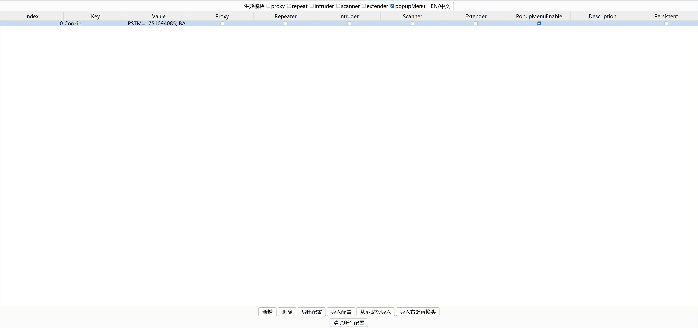
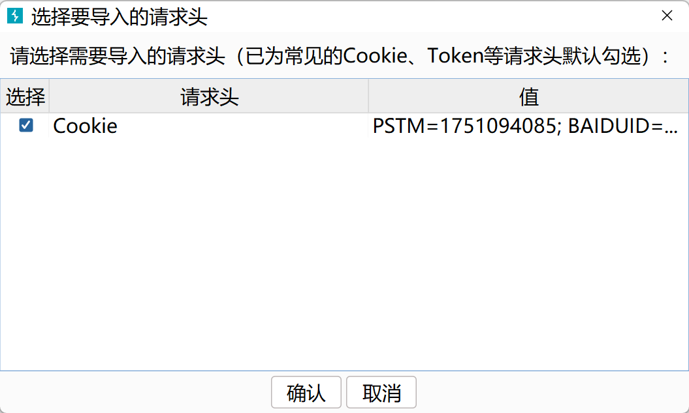
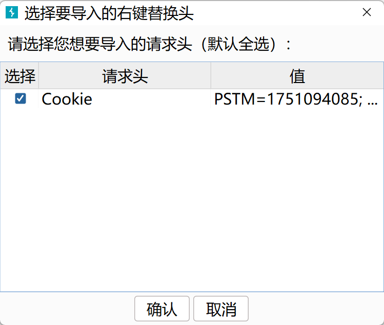
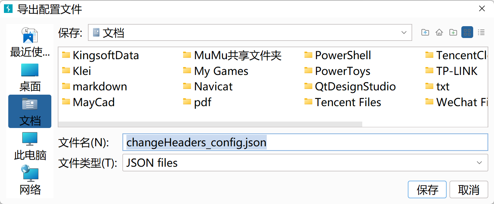
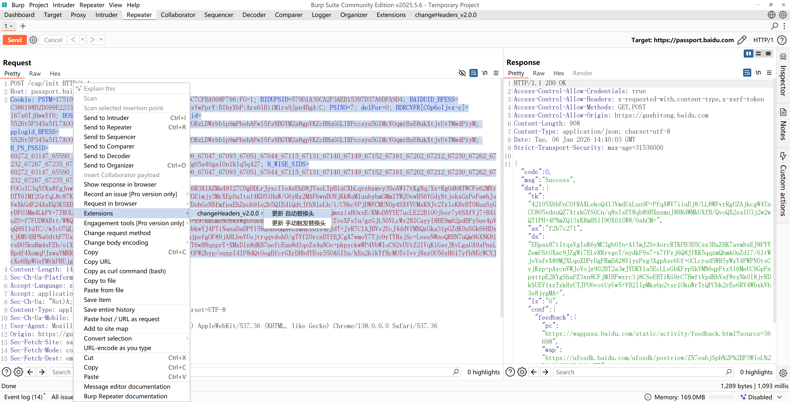
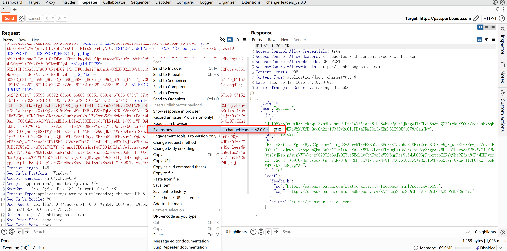

# changeHeaders - 高级HTTP头操作工具

[](https://www.oracle.com/java/technologies/)
[](https://portswigger.net/burp)
[](LICENSE)

[English Version](README_en.md)

## 🌟 概述

changeHeaders是一个功能强大的Burp Suite扩展插件，允许安全专业人员和开发人员轻松修改HTTP请求头。无论您是在进行渗透测试、漏洞赏金 hunting，还是应用程序调试，changeHeaders都能简化跨多个Burp Suite工具的请求头操作过程。

通过直观的GUI和强大的配置管理，changeHeaders可帮助您：
- 通过添加/修改安全头来绕过安全限制
- 使用不同的用户代理或引荐来源测试应用程序行为
- 模拟来自不同来源或设备的请求
- 自动化重复的请求头修改任务

## ✨ 主要功能

### 🔧 强大的请求头管理
- **添加/修改/删除请求头**：通过用户友好的表格界面轻松管理HTTP请求头
- **批量操作**：在不同工具中同时应用多个请求头更改
- **启用/禁用规则**：动态切换请求头修改，无需删除配置

### 🎯 多工具集成
- 与所有主要Burp Suite工具无缝协作：
  - Proxy
  - Repeater
  - Intruder
  - Scanner
  - Extender
- 上下文菜单集成，快速访问请求头修改界面

### 💾 智能配置管理
- **自动保存**：所有配置都会自动保存并在会话间持久化
- **导入/导出**：使用JSON格式轻松在团队成员或项目间共享配置
- **选择性应用**：选择哪些Burp工具应应用您的请求头修改

### 🌍 国际化
- **多语言支持**：提供中文和英文两种语言
- **便捷语言切换**：单击即可切换语言

### 🛠 高级功能
- **模块特定规则**：为不同的Burp Suite模块应用不同的请求头
- **实时预览**：在发送请求前查看请求头更改
- **持久化存储**：使用Burp的扩展设置自动保存配置
- **右键菜单集成**：
  - **自动替换**：从选中的请求文本中自动添加/更新请求头
  - **手动触发替换**：添加可通过上下文菜单手动应用的请求头
  - **主动请求头替换**：将选中的请求头直接应用到HTTP编辑器中的当前请求

### 🔄 两种操作模式
1. **自动模式**：根据模块设置自动应用请求头
2. **手动模式**：仅在通过上下文菜单手动触发时应用请求头

### 📋 新增功能特性
- **剪贴板导入**:从系统剪贴板一键导入HTTP请求头,自动解析并让用户选择需要添加的请求头
- **智能默认选择**:常见的安全相关请求头(如Cookie、Authorization、Token等)会自动勾选
- **持久化控制**:可控制每个请求头是否在插件卸载或退出时保存,通过剪贴板导入的请求头默认不持久化
- **选择性持久化**:在导出配置或插件退出时,仅保存标记为持久化的请求头
- **右键替换头导入**:从表格下方按钮弹窗选择导入已启用右键手动替换功能(popupMenuEnable)的请求头,方便快速复制和管理常用的手动替换规则

## 📋 安装

### 先决条件
- Java 8或更高版本
- Burp Suite Professional或Community Edition

### 安装方法

#### 方法1：直接JAR安装
1. 从[GitHub Releases](https://github.com/your-repo/changeHeaders/releases)下载最新的JAR文件
2. 打开Burp Suite
3. 导航到`Extensions` → `Installed`
4. 点击`Add`
5. 选择`Extension type`为`Java`
6. 浏览并选择下载的JAR文件
7. 点击`Next`完成安装

#### 方法2：从源码构建
```bash
# 克隆仓库
git clone https://github.com/your-repo/changeHeaders.git
cd changeHeaders

# 使用Maven构建（标准构建）
mvn clean package

# 使用Maven构建（带时间戳的调试构建）
mvn clean package "-Ddebug.build=true"

# JAR文件将在target/目录中生成
```

**注意**：使用`-Ddebug.build=true`构建时，将生成一个带时间戳的附加JAR文件（例如`changeHeaders-1.9.0-20250801170300.jar`）。这在开发和调试过程中区分不同构建版本时非常有用。

## 🚀 快速入门指南

### 1. 配置目标模块
安装后，Burp Suite中将出现一个新的`changeHeaders_v1.9.0`标签页：
- 选择哪些Burp Suite模块应应用您的请求头修改
- 可用模块：Proxy、Repeater、Intruder、Scanner、Extender
- 启用"popupMenu"以通过上下文菜单手动应用请求头



*主界面截图：展示了模块选择、请求头管理表格和功能按钮*

## 2. 添加请求头规则
四种添加请求头规则的方法:

1. **手动添加**:在主界面中点击`Add`创建新的请求头规则

2. **从请求添加**:在任何HTTP请求中选择请求头文本并右键单击选择"新增自动替换头"或"新增手动触发替换头"

3. **从剪贴板导入**:点击"从剪贴板导入"按钮,自动解析剪贴板中的HTTP请求头并让用户选择需要添加的请求头

   
   
   *从剪贴板导入功能：自动解析HTTP请求头并弹窗选择*

4. **导入右键替换头**:点击"导入右键替换头"按钮,从已启用popupMenu功能的请求头中选择导入,方便复用手动触发替换的规则

   
   
   *导入右键替换头功能：从剪贴板导入并设置为右键手动替换模式*

### 3. 应用请求头到请求
三种应用请求头修改的方法：
1. **自动应用**：当启用的模块处理请求时，请求头会自动应用
2. **右键方法**：在任何Burp工具中，右键单击请求并选择`Send to changeHeaders`
3. **上下文菜单应用**：对于启用了"popupMenu"的请求头，在HTTP编辑器中右键单击并选择"替换"以直接应用这些请求头

### 4. 管理配置
- **导出**：将您的请求头配置保存到JSON文件中以进行备份或共享
- **导入**：加载以前保存的配置
- **清除**：单击即可删除所有配置



*导出配置功能：将请求头配置保存为JSON文件以便备份或分享*

## 🎯 使用场景

### 安全测试
```
X-Forwarded-For: 127.0.0.1
X-Real-IP: 127.0.0.1
X-Client-IP: 127.0.0.1
```
通过伪造内部IP地址绕过基于IP的访问控制。

### 用户代理欺骗
```
User-Agent: Mozilla/5.0 (iPhone; CPU iPhone OS 14_0 like Mac OS X)
```
测试应用程序的移动版本或绕过特定于浏览器的限制。

### 身份验证测试
```
Authorization: Bearer <token>
X-API-Key: <key>
```
在不同的身份验证令牌或API密钥之间快速切换。

### 上下文菜单使用

1. **选择请求头进行右键菜单更新**：
   
   
   
   *在HTTP请求中选择请求头,右键点击可选择自动或手动触发替换模式*

2. **自动替换请求头**：
   - 在任何HTTP请求中选择请求头行
   - 右键单击并选择"新增自动替换头"
   - 请求头将自动应用到启用模块的所有请求中

3. **手动触发替换**：
   - 在任何HTTP请求中选择请求头行
   - 右键单击并选择"新增手动触发替换头"
   - 在主界面中为这些请求头启用"popupMenu"
   - 在任何HTTP编辑器中右键单击并选择"替换"以应用这些请求头
   
   
   
   *在HTTP编辑器中右键点击选择"替换",手动应用已配置的请求头*

## 🧪 测试HTTP服务

项目内置了一个专用于测试插件功能的HTTP服务，位于`onlineStore/`目录。

### 功能特点
- **多种验证端点**：提供认证、Cookie、IP伪造、User-Agent等多类型的请求头验证测试
- **模块化设计**：前后端分离，便于维护和扩展
- **日志记录**：支持控制台和文件双输出
- **可视化界面**：提供简洁美观的Web测试界面

### 快速开始

```bash
# 进入测试服务目录
cd onlineStore

# 启动服务
python server.py

# 或者在Windows上双击 start.bat
```

服务启动后访问 http://127.0.0.1:8888 即可使用测试界面。

### 测试流程
1. 直接访问测试端点 → 查看失败提示（缺少必要的请求头）
2. 复制提示中的请求头规则
3. 在changeHeaders插件中配置规则
4. 通过BurpSuite代理再次访问 → 验证成功

### API端点列表

| 类别 | 端点 | 验证条件 |
|-----|------|--------|
| 认证 | `/api/auth/bearer` | Authorization: Bearer xxx |
| 认证 | `/api/auth/basic` | Authorization: Basic (admin:password123) |
| 认证 | `/api/auth/api-key` | X-API-Key: test-api-key-12345 |
| Cookie | `/api/session/required` | Cookie: session=abc123xyz789 |
| IP | `/api/ip/internal-only` | X-Forwarded-For: 192.168.x.x |
| UA | `/api/ua/mobile-only` | User-Agent 含 iPhone/Android |
| 综合 | `/api/admin/panel` | Basic + AdminToken + 内网IP |

## 🤝 贡献

欢迎贡献代码！您可以按以下方式帮助我们：

1. Fork仓库
2. 创建功能分支（`git checkout -b feature/AmazingFeature`）
3. 提交您的更改（`git commit -m 'Add some AmazingFeature'`）
4. 推送到分支（`git push origin feature/AmazingFeature`）
5. 发起Pull Request

请确保您的代码遵循现有风格并包含适当的测试。

## 📄 许可证

本项目采用MIT许可证 - 详见[LICENSE](LICENSE)文件。

## 📞 支持

- 对于错误报告和功能请求，请使用[GitHub Issues](https://github.com/your-repo/changeHeaders/issues)
- 对于一般问题，请查看文档或联系维护人员

## 🙏 致谢

- 感谢Burp Suite团队提供出色的安全测试平台
- 灵感来源于对更高效的Web应用程序测试中HTTP请求头操作的需求

## ⚠️ 免责声明

本工具仅供合法的安全测试和研究目的使用。用户有责任确保其使用符合所有适用的法律和法规。作者不对因使用此工具而导致的任何损害或法律后果承担责任。在使用此工具进行任何测试之前，请确保您已获得目标系统的明确授权。未经授权的系统访问可能违反法律。

使用本工具即表示您理解并同意：
1. 您将仅在您拥有明确授权的系统上使用此工具
2. 您将遵守所有适用的地方、州和联邦法律
3. 您理解不当使用可能导致法律后果
4. 作者不对工具的误用或由此产生的任何损害负责
5. 您在企业或组织中使用此工具时，应遵守该组织的安全政策和规定