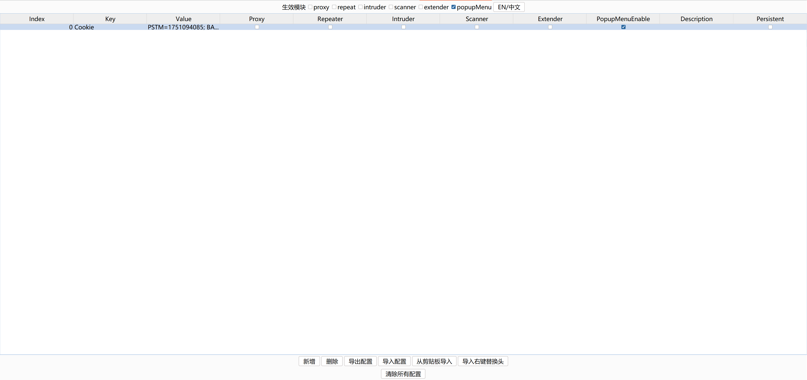

# changeHeaders - 高级HTTP头操作工具

[](https://www.oracle.com/java/technologies/)
[](https://portswigger.net/burp)
[](LICENSE)

[English Version](README_en.md) | [详细教程](doc/usage-guide.md) | [变更日志](doc/CHANGELOG.md) | [视频脚本](doc/video-script.md)

## 🌟 概述

changeHeaders是一个功能强大的Burp Suite扩展插件，允许安全专业人员和开发人员轻松修改HTTP请求头。

通过直观的GUI和强大的配置管理，changeHeaders可帮助您：
- 通过添加/修改安全头来绕过安全限制
- 使用不同的用户代理或引荐来源测试应用程序行为
- 模拟来自不同来源或设备的请求
- 自动化重复的请求头修改任务

## ✨ 主要功能

| 功能 | 说明 |
|-----|------|
| 🔧 请求头管理 | 添加/修改/删除请求头，批量操作，动态切换 |
| 🎯 多工具集成 | 支持Proxy、Repeater、Intruder、Scanner、Extender |
| 💾 配置管理 | 自动保存、JSON导入导出、选择性应用 |
| 🌍 国际化 | 中英双语支持 |
| 🔄 双模式 | 自动模式 + 手动替换模式 |
| 📋 智能导入 | 剪贴板解析、右键快速添加 |

## 📋 快速安装

### 环境要求
- Java 8+
- Burp Suite Professional/Community

### 安装步骤
1. 从 [GitHub Releases](https://github.com/GitHubNull/changeHeaders/releases) 下载JAR文件
2. Burp Suite → Extensions → Installed → Add
3. 选择Java类型，加载JAR文件

> 详细安装说明请参考 [使用教程](doc/usage-guide.md#安装指南)

## 🚀 快速入门

### 1. 配置模块
安装后，在changeHeaders标签页中勾选需要应用请求头的模块（Proxy、Repeater等）。



### 2. 添加规则

四种方式添加请求头规则：

| 方式 | 说明 |
|-----|------|
| 手动添加 | 点击Add按钮，输入Header名称和值 |
| 右键添加 | 选中请求中的Header，右键添加 |
| 剪贴板导入 | 批量导入，自动解析 |
| 导入替换头 | 复用已有的右键替换规则 |

### 3. 应用请求头

- **自动模式**：启用规则后自动应用到所有请求
- **手动模式**：在HTTP编辑器中右键选择"替换"

> 完整使用教程请参考 [详细使用教程](doc/usage-guide.md)

## 🎯 使用场景

```bash
# IP绕过
X-Forwarded-For: 127.0.0.1

# UA欺骗
User-Agent: Mozilla/5.0 (iPhone; CPU iPhone OS 14_0 like Mac OS X)

# 认证测试
Authorization: Bearer <token>
```

## 🧪 测试HTTP服务

项目内置测试服务，提供多种请求头验证端点：

```bash
cd onlineStore
python server.py
# 访问 http://127.0.0.1:8888
```

| 端点 | 验证条件 |
|-----|--------|
| `/api/auth/bearer` | Authorization: Bearer xxx |
| `/api/auth/basic` | Basic Auth (admin:password123) |
| `/api/session/required` | Cookie: session=abc123xyz789 |
| `/api/ip/internal-only` | X-Forwarded-For: 192.168.x.x |

> 完整API列表请参考 [测试服务文档](doc/test-server.md)

## 📚 文档

- [详细使用教程](doc/usage-guide.md) - 完整的安装和使用指南
- [测试服务文档](doc/test-server.md) - 测试HTTP服务详解
- [变更日志](doc/CHANGELOG.md) - 版本变更记录
- [视频宣传脚本](doc/video-script.md) - 视频制作参考

## 🤝 贡献

欢迎贡献代码！

1. Fork仓库
2. 创建功能分支 (`git checkout -b feature/AmazingFeature`)
3. 提交更改 (`git commit -m 'Add AmazingFeature'`)
4. 推送分支 (`git push origin feature/AmazingFeature`)
5. 发起Pull Request

## 📄 许可证

MIT License - 详见 [LICENSE](LICENSE)

## 📞 支持

- [GitHub Issues](https://github.com/GitHubNull/changeHeaders/issues) - 问题反馈
- [Releases](https://github.com/GitHubNull/changeHeaders/releases) - 版本下载

## ⚠️ 免责声明

本工具仅供合法的安全测试和研究目的使用。使用前请确保已获得目标系统的明确授权。
